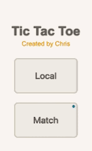
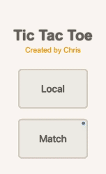

# 🎮 Tic Tac Toe ⭕️❌⭕️
A simple Tic-Tac-Toe game designed for both local and network play. Enjoy classic gameplay with a clean interface and responsive design.

## Table of Contents  
- [Getting Started](#getting-started)  
- [Play with Friends Across Devices](#play-with-friends-across-devices)  
- [Screenshots](#screenshots)  
- [Tech Stack](#tech-stack)  

## Getting Started
This project is Dockerized for quick and easy setup. Follow these steps:  

1. **Install Docker**: Refer to the official [Docker Installation Guide](https://docs.docker.com/engine/install/).  

2. **Build and Run the Application**:
```bash
docker compose build
docker compose up
```

3. **Go to the [Web Server](http://localhost:3000) and Enjoy Your Game!**

## Run Server Independently
If you prefer running the `frontend` and `backend` servers independently, refer to the steps below.

**Frontend Server**
```bash
cd tic-tac-toe-frontend
npm install
npm run build
cp -r public .next/standalone/ && cp -r .next/static .next/standalone/.next/
npm run start
```

**Backend Server**
```bash
cd tic-tac-toe-backend
npm install
npm start
```

## Play with Friends Across Devices
1. Before run the application, open a file `tic-tac-toe-frontend` > `.env.local`, then change `SERVER_URL` to your host ip address.

2. Ensure both devices and the host are on the same network.
3. Go to http://`HOST_IP_ADDRESS`:3000 in browser.
4. Challenge your friends to a match and enjoy the game!

## Screenshots



## Tech Stack
- **Frontend**: Next.js, React, Three.js, TypeScript, HTML, CSS
- **Backend**: Node.js, Express.js, TypeScript
- **Networking**: Socket.IO for real-time multiplayer functionality
- **Tools**: Docker and Docker Compose for seamless deployment